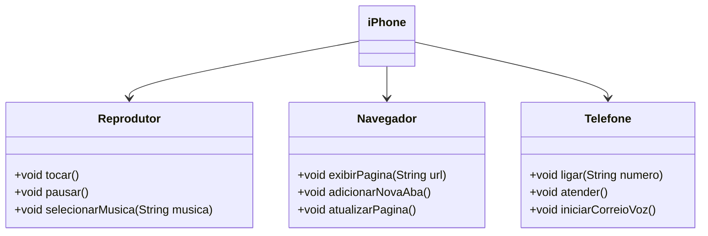

```mermaid
classDiagram
    class iPhone {
    }

    class Reprodutor {
        +void tocar()
        +void pausar()
        +void selecionarMusica(String musica)
    }

    class Navegador {
        +void exibirPagina(String url)
        +void adicionarNovaAba()
        +void atualizarPagina()
    }

    class Telefone {
        +void ligar(String numero)
        +void atender()
        +void iniciarCorreioVoz()
    }

    iPhone --> Reprodutor
    iPhone --> Navegador
    iPhone --> Telefone

```